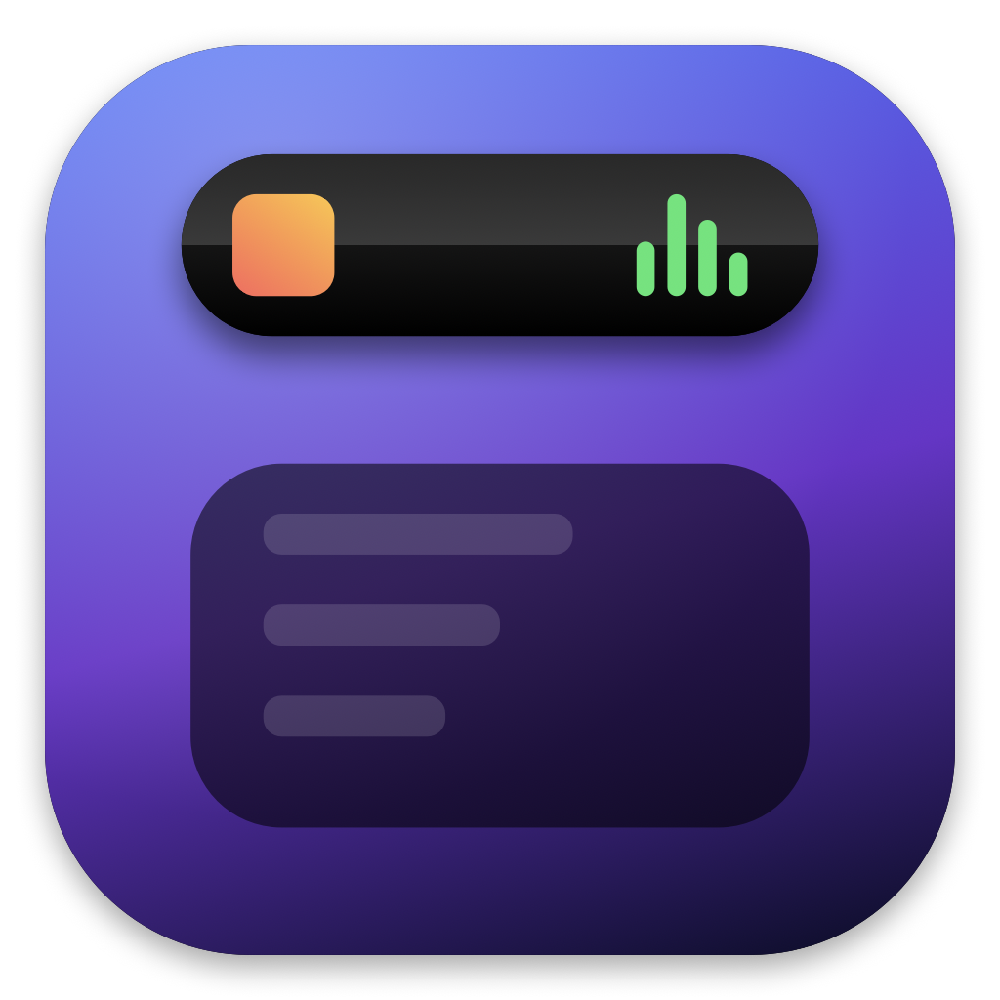

<p align="center"></p>
<h1 align="center">NotchIsland for Windows</h1>
<p align="center">A Dynamic Island for the top of your Windows screen. Hover to expand: now playing, live transit, timetable, screenshots, clipboard, timer, weather.<br>
<b>Created by Adam Brož</b> · Windows 10 (19041+) / 11 · .NET 8 · Avalonia UI</p>
<p align="center"><a href="https://github.com/Brozovec/NotchIsland-Windows/releases/latest">Download (ZIP, no install)</a> · <a href="https://github.com/Brozovec/NotchIsland">macOS version</a> · <a href="https://notchisland.brozovec.eu">Website</a></p>

> **Status: first Windows build.** It was written and compiled on a Mac and could not be tested on real Windows yet. Expect rough edges and please report issues with the log file (see below).

## What it does
A small black island sits at the top center of your screen. Hover it and it expands into tabs:

| Tab | Features |
|---|---|
| **Island** | Now Playing from Spotify, browsers, Apple Music or any app (Windows media session) with artwork and controls · calendar strip · weather tile for your location |
| **Tray** | Drop files onto the island to park them, drag them out later |
| **Transit** | Prague (PID) departures with delays (needs a free Golemio token) · RegioJet / FlixBus search with prices, seats and live delay · IDOS link for Czech Railways |
| **Calls** | Shows which call apps are running (Discord, Zoom, Teams, Slack, …) |
| **Shot** | `Ctrl+Shift+2` area, `Ctrl+Shift+1` screen, `Ctrl+Shift+O` text recognition (OCR). Copied to clipboard and saved to Pictures\NotchIsland |
| **Notes** | Quick notepad, saves itself |
| **Clipboard** | History of the last 10 things you copied (`Ctrl+Shift+V`), click pastes into the active app, pin items |
| **Timer** | Countdown and Pomodoro 25/5, countdown shows in the collapsed island |
| **Timetable** | Bakaláři school timetable: today's lessons, week grid, substitutions, cancellations, break countdown in the island |

Czech and English (follows system language, switchable in Settings). Settings are in the tray icon menu or the gear in the island.

## Install
1. Download `NotchIsland-Windows-x.y.zip` from [Releases](https://github.com/Brozovec/NotchIsland-Windows/releases/latest) and unzip it anywhere (e.g. `C:\Program Files\NotchIsland`).
2. Run `NotchIsland.exe`. Windows SmartScreen may warn because the app is not signed: click **More info → Run anyway**. Once.
3. The island appears at the top of the screen; the app also lives in the system tray and adds itself to startup (Settings → Launch at login to turn off).

No .NET installation needed, the exe is self-contained (that is why it is ~120 MB).

## Build from source
```powershell
git clone https://github.com/Brozovec/NotchIsland-Windows.git
cd NotchIsland-Windows
dotnet publish -f net8.0-windows10.0.19041.0 -r win-x64 -c Release --self-contained -p:PublishSingleFile=true -o publish
```
Needs the .NET 8 SDK or newer (the Avalonia 12 generator needs a C# 13 compiler, so .NET 9/10 SDK is safest). The project also builds and runs on macOS/Linux for UI development (`dotnet run -f net8.0`), with the Windows-only parts (media session, hotkeys, OCR, autostart) disabled there.

## Troubleshooting
- Log: `%APPDATA%\NotchIsland\log.txt`. Settings: `%APPDATA%\NotchIsland\settings.json`.
- Nothing plays in Now Playing: the app reads the Windows media session, so the player must show up in the volume flyout's media controls.
- Transit "Enter a Golemio token": get one free at api.golemio.cz/api-keys and paste it in Settings.
- Hotkeys do nothing: another app (ShareX, Greenshot, PowerToys) may own the same combination.

## License
Custom attribution license, see [LICENSE](LICENSE). Free to use and modify; credit to Adam Brož must stay.
